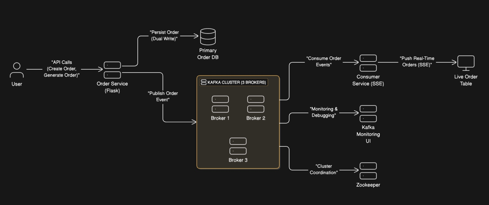
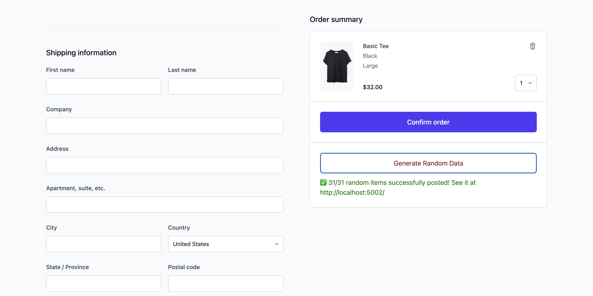
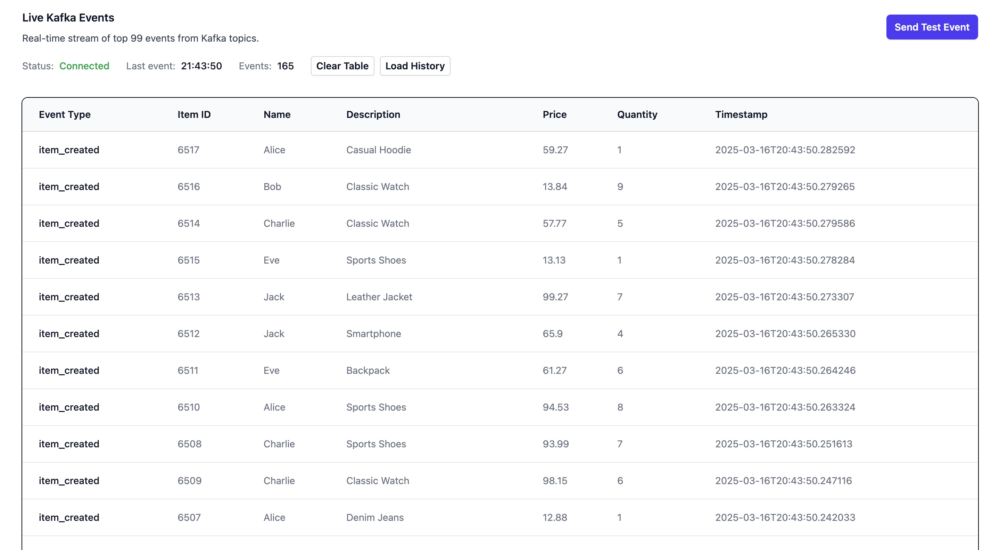
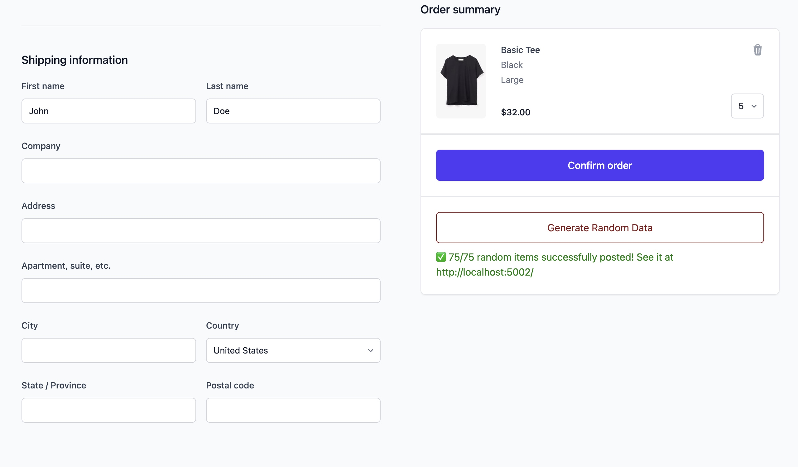
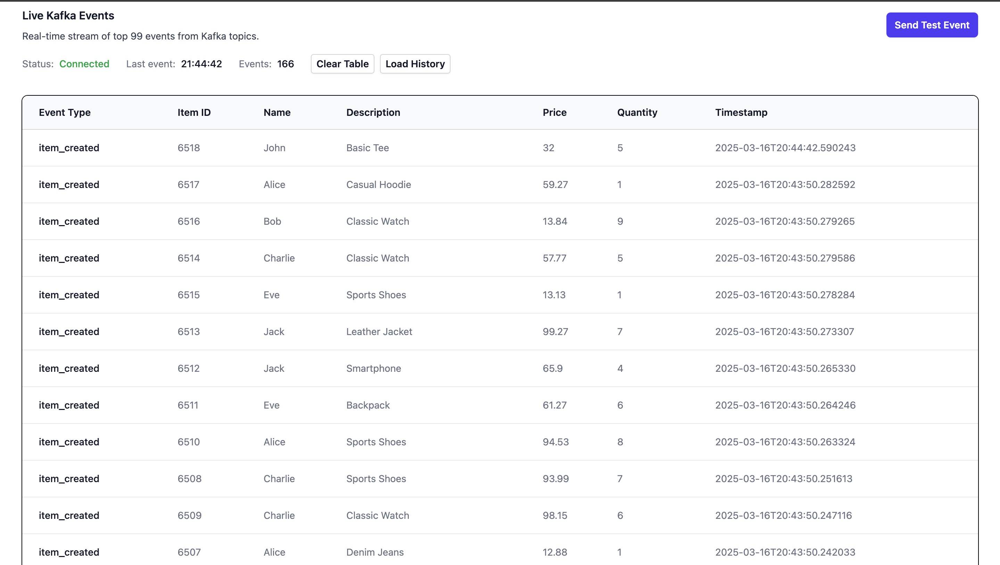

# Order Processing System

## Overview

This project is an attempt to build systems similar to those used by Uber and other high-scale companies, designed for real-time, distributed order processing. It is powered by Flask, PostgreSQL, Kafka, and Docker Compose, ensuring high performance and scalability.

The system efficiently handles real-time order processing, allowing users to create orders manually or generate them randomly. The system dual-writes orders into PostgreSQL and streams them to a Kafka topic, ensuring event-driven data consistency. A Kafka consumer listens for order events and updates the UI dynamically using Server-Sent Events (SSE) for a seamless real-time experience.

## Architecture




### Key Components
- **Flask Backend**: API that processes and stores orders with Active Record architecture while publishing events to Kafka.
- **PostgreSQL Database**: Reliable storage for structured order data.
- **Kafka Cluster**: Distributed message broker for scalable, event-driven processing.
- **Kafka Consumer**: Consumes order events and pushes live updates via SSE.
- **Kafka UI**: Web-based Kafka management and monitoring interface.
- **Docker Compose**: Containerized orchestration for simplified deployment.

## System Flow
1. **User submits an order** (via API or random generator in Flask backend).
2. **Flask processes order** and simultaneously writes it to **PostgreSQL** and **Kafka**.
3. **Kafka logs the event** in its distributed message queue.
4. **Kafka Consumer listens** and pushes the update via **SSE** to the UI.
5. **Users see real-time order updates** on the HTML dashboard.

## Screenshots

**Generate Random Data in http://localhost:5001/**


**Live result in localhost:5002**



**Manual Entry**


**Result from the manual entry will be displayed in the first row**



## Technologies Used
- **Flask** (Python web framework for the backend API)
- **PostgreSQL** (Robust relational database for order storage)
- **Apache Kafka** (Event streaming platform for real-time messaging)
- **Zookeeper** (Kafka High Availability & Cluster Management)
- **Server-Sent Events (SSE)** (Live data streaming to the UI)
- **Docker Compose** (Containerized orchestration for seamless deployment)

## Setup Instructions

### Prerequisites
Ensure you have the following installed:
-  **Docker & Docker Compose**
-  **Python 3.8+**

### Running the System
1. Clone the repository

2. Grant execute permissions to the startup script:
   ```bash
   chmod +x start_project.sh
   ```
3. Build and start the services:
   ```bash
   ./start_project.sh
   ```
4. Verify that all services are running:
   - **Kafka UI**: [http://localhost:8080](http://localhost:8080)
   - **Flask Backend**: [http://localhost:5001](http://localhost:5001)
   - **Kafka Consumer**: [http://localhost:5002](http://localhost:5002)


## Future Enhancements
- **Load Balancing** by scaling Kafka consumers and adding more partitions.
- **Outbox pattern** Add Debezium that listens to PostgreSQL CDC
- **Circuit Breaker** Add Circuit Breaker for Kafka producer


